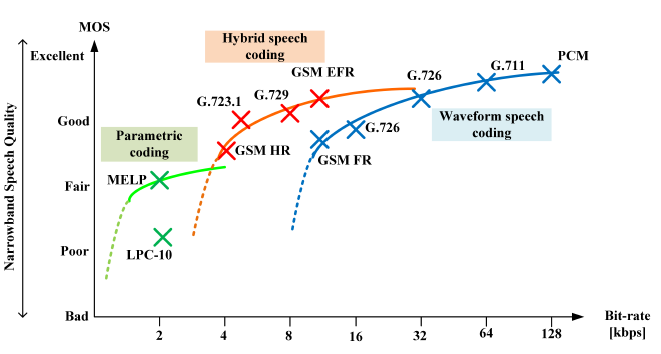

## Introduction
### 语音编码得理论极限
一个语言一般有25到30个字母，可以对应为每个字母大约4到5bit，语音调制频率大学为10到15Hz，那么声学信息率大约为50bit/s。再加上其他信息量，例如情绪、性别、年龄，我们可以假设这些信息率为150bits/，所以口语独白得信息率约为200bit/s。但是目前语音编解码器达到能够接受得语音质量需要的信息率大学为8000bit/s，这与理论极限有40倍的差距，所以语音编码仍有很大的提升空间。

### 语音编码的目标
* 高质量，感知质量包含清晰度和愉悦度两部分：perceptual quality = intelligibility + pleasantness
* 高鲁棒性，可以适应不同的语言，不同的说话者
* 低延时，能够保证正常的交流
* 低比特率，尽量减少所需要的带宽
* 低复杂度吗，使算法能够在大众化的设备上运行，消耗尽量少的内存和计算力

### 感知质量
我们当然希望编解码器尽量的透明，是我们感受不到它的存在，但是这是我们目前无法达到的，因此我们有一些测量标准：

* 恼人度与愉悦度：没有被掩蔽掉的畸变当然会带来恼人的感觉，但是如果畸变方式不同，即使使同样的信噪比情况下也会带来不同的感受。（小误差时使用这一测量标准）
* 易听度：质量差的语音会令人烦躁（中等误差时使用这一测量标准）
* 清晰度：严重的畸变会使语音变得无法理解（大误差时使用这一测量标准）

### 语音编码的发展
语音编码的发展过程为波形编码，参数编码再到混合编码。波形编码需要能获得很好的语音质量，但是对比特率的要求也很高，参数编码可以使用很低的比特率来进行，但是语音质量却很差，而混合编码所要求的比特率在这两者之间，但是却能获得很好的质量，可以看下边这张图比较这三者这差别：

