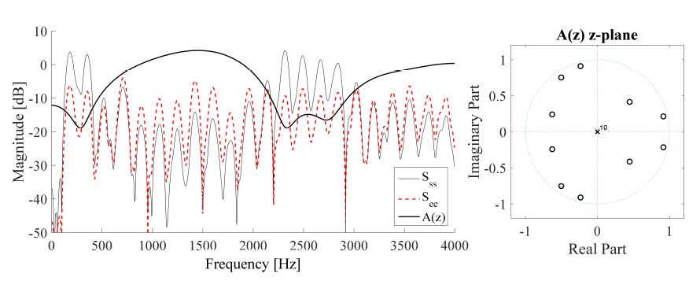
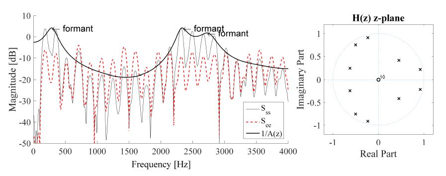
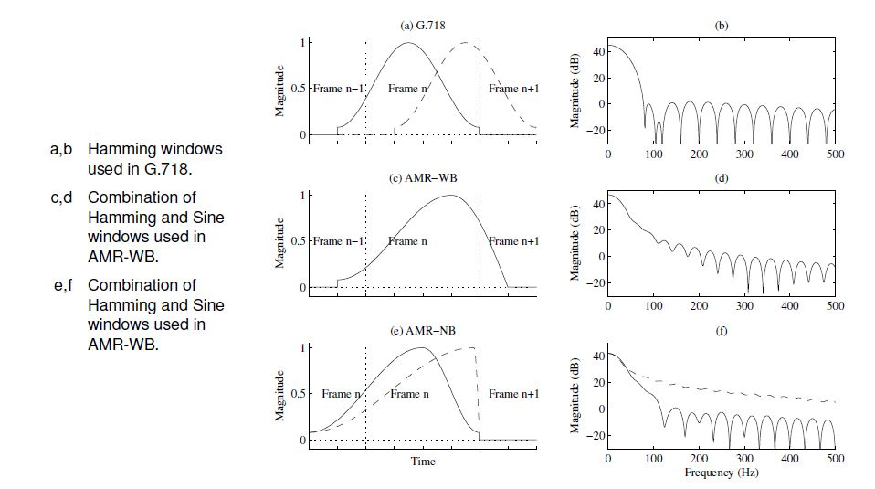
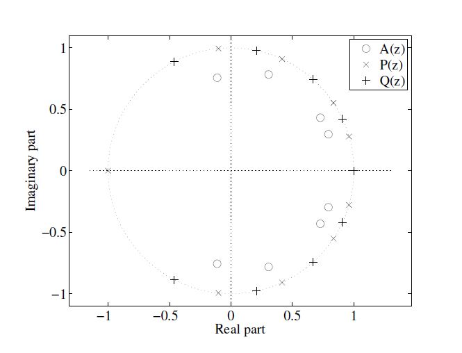
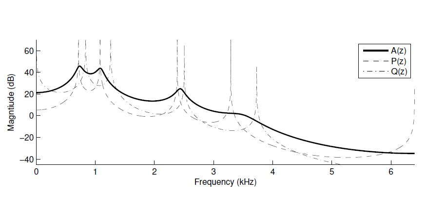

## Spectral Envelope
### Linear Predictive Coding
LPC可以被看做是对声道的建模，但同时也可以看成是对spectral envelope的建模，频谱包络被LPC的系数编码。LPC的中心思想是使用过去的采样点，加权并求和并加上一个残差项来预测当前的采样点，公式表示如下：

ak为LPC系数，sigman为残差项，我们可以将a0定义为1，将残差项单独留在等号一边，公式就可以改写为：

写可以写作向量相乘的形式：

为了能够得到最佳的线性预测模型，我们希望残差越小越好，一般的方法是最小化残差的能量期望：

这里，是一个对称对角矩阵：

且：

（参数的求解 hold on）

在编码端，求解好的LPC，其实是一个全零点滤波器，变换的Z域的公式如下：

对于一帧数据的处理效果如下，A(z)是LPC滤波器的幅频响应，可以看到原信号SS在被滤波器处理后得到了残差信号ee，而ee更接近一个白噪声信号，而A(z)就包含了原信号的包络信息，所以对LPC参数进行傅里叶变换就可以得到信号频谱的包络信息：

在解码端的LPC滤波器就变成了一个全极点滤波器，公式如下：

当解码端的LPC变回一个全极点滤波器之后，就可以对白噪声做一个整形，如下图将ee残差信号变回ss原始信号。

在被LPC处理之前，一帧语音要经过加窗处理，常用的窗如下，后两种窗的延时比较小：

### LPC参数的量化

当获得LPC的参数之后，我们需要将其量化再传输，但是LPC的参数对误差非常敏感，很少的误差就会造成结果的偏差很大，如果为了提高量化精度，就需要很多的bit来传输LPC参数。而最佳传输参数的方式是在Line Spectral Frequency域来量化参数，公式如下(K一般为1)：

P(z)和Q(z)的极点交错的出现在单位圆上，小的误差不会对结果造成很大的影响。A(z)=(P(z)+Q(z))/2

