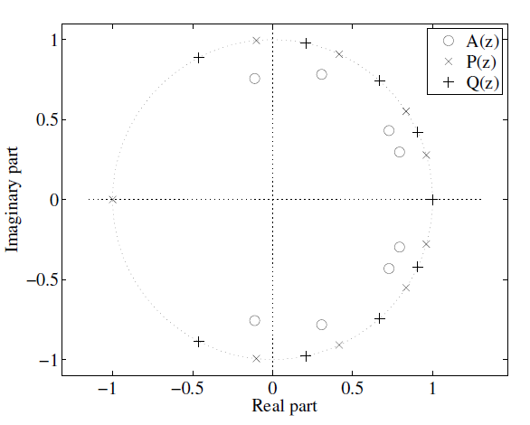
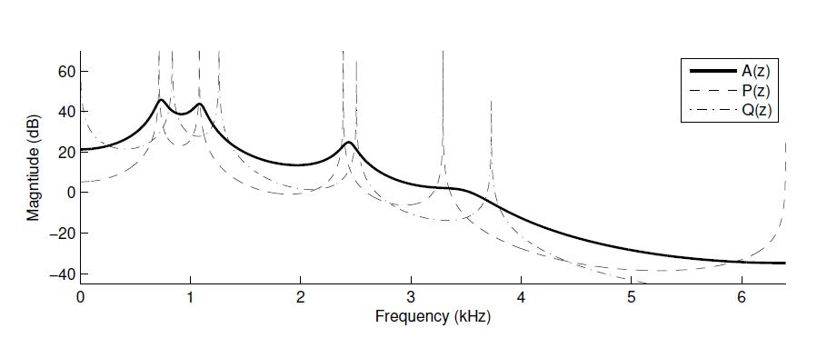

## Line Spectral Pairs

### 什么是LSP(Line Spectral Pairs)？

LSP可以用来可以用来代表Line Prediction的参数，由于Line Prediction参数的稳定性差，在信号传输过程中，少量的噪声就可能导致恢复出来的信号包络与原始信号有较大的误差。同时它也与频谱特性相关，可以用来分析语音信号.

LSP中单个的Line叫做LSF(Line Spectral Frequency),两个LSF表示两个谐振条件(resonance conditions)，分别是声带为全开和全关的状态，这也就是LSP的物理意义。

LSP就是一对单位圆上的全极点滤波器，这两个滤波器的幅频响应线性叠加可以无限逼近于他们想要代表的LP滤波器。

### LSP如何获得？

LSP可以直接从LP参数中获得。p阶分析的表达如下：

$$
A_{p}(z)=\frac{P(z)+Q(z)}{2}
$$

P，Q两组多项式表示声道状态为全关和全开的情况，所有实际情况下的A可以表示为这两组多项式的线性组合：

todo： 公式 A = 1/2（p+q）

todo: 公式 P = A - term

todo: 公式 Q = A + term

P，Q多项式的根就是LSF。而他们的复数根都落在Z域的单位圆上。可以用估计的方法近似获得。

### 如何从LSP获得LPC参数？

略

### LSP的传统用法有什么？

#### 1.LSP用于语音编码
LSP可以被用在语音编码当中，在一个通用的CELP编码器的编码端会解析出每帧语音的4个参数，分别是音高信息，码本索引，增益和LSP。这4个参数都有分别对应的物理含义。

* 由码本索引可以获得肺部产生的激励信号
* 音高信息表现声带的震动状态
* 增益代表声音的幅度大小
* LSP则包含了声道信息，其中包括嘴型，舌头位置以及鼻腔的作用。

#### 2.LSP量化方法

LSP代替LP参数的优点是具有更加的稳定性，可以使用较少的bit来量化，从下表中可以看出当使用的比特数少时，量化LSP能获得较高的信噪比；缺点是会引入更多的计算复杂度。

todo ： table1

对不同位置的LSF进行分组量化是一种更好的选择，例如对于一个10阶的系统，可以采用（2，3，3，2）或者（3，3，4）的分组方式，不同的Line可以用不同长度的bit来量化，这样做的原因是:
1. 不同位置的Line有着不同的重要性，重要性较低的LSF不需要高精度的量化，如低阶的LSF一般代表前几个共振峰，重要性更高，
2. 也有不同的统计分布，例如1，10这样位置上的Line拥有更加集中的分布，也就是说相比5，6Line，用较少的bit就可以更精准的表示。

todo ： table2

所以采用非均一划分的方式去量化LSFs更加高效；甚至可以采用动态选择量化方法的方式进一步提高效率，例如指定两套量化方案，对不同帧采用更合适的量化方案，但这样需要一个额外的比特位来表示采用了哪种方案；引入Vector Quantization可以进一步压缩使用的bit数。

### LSP的高阶用法

1. 窄间隔的LSP可以指示出谱峰的位置
2. 由于LSP表示声道特征，所以可以结合其他参数来检测语音
3. 可以通过控制LSP的方法控制共振峰
